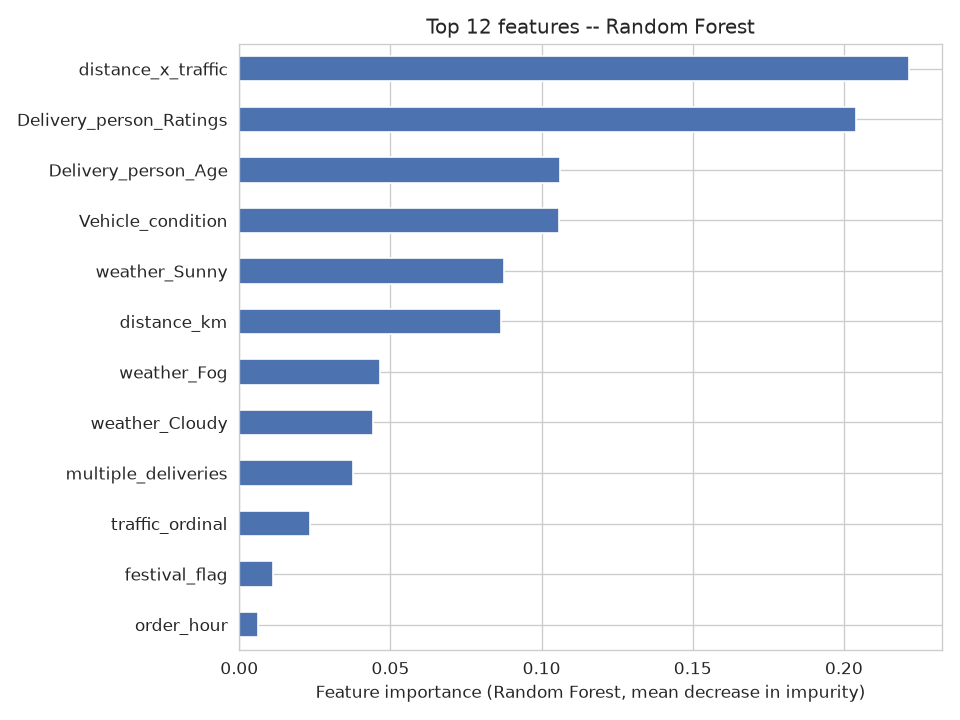

# Food Delivery ETA Prediction

A case study predicting how long a food delivery order will take (in
minutes), using only information available at the moment the order is
placed -- distance, traffic, weather, delivery partner details, and time
of order.

## 1. Why this matters

When a customer places a food delivery order, the ETA shown at checkout
is one of the biggest drivers of whether they trust the app and whether
they contact support later ("where's my order"). A model that's off by
15 minutes either way is worse than no estimate at all -- it either sets
an expectation the delivery blows past, or it makes the app look
overly conservative next to a competitor. This project builds and
honestly evaluates a delivery-time model using order-time signals only
(no live GPS, no mid-delivery updates), which is the realistic
constraint at the point an ETA actually needs to be shown.

## 2. Dataset

**Source:** [Food Delivery Dataset](https://www.kaggle.com/datasets/gauravmalik26/food-delivery-dataset)
(gauravmalik26, Kaggle). Kaggle API credentials weren't available in the
dev environment this was built in, so the file was pulled from a public
GitHub mirror ([Vikranth3140/Food-Delivery-Time-Prediction](https://github.com/Vikranth3140/Food-Delivery-Time-Prediction),
`datasets/kaggle/train.csv`) whose own README links back to the same
Kaggle page -- same data, different download path.

- **45,593 rows** as delivered, **40,197 after cleaning** (88.2% kept).
- Each row is one food delivery order in India, placed between
  2022-02-11 and 2022-04-06, from a food-delivery platform's order log.
- Columns include restaurant/delivery coordinates, order timestamp,
  weather, road traffic density, delivery partner age/rating, vehicle
  type/condition, order type, festival flag, city type, and the target
  (`Time_taken(min)`).

## 3. EDA findings

- **Target distribution:** mean 26.3 min, median 26 min, std 9.4,
  right-skewed (skew 0.49), range 10-54 min after cleaning. No negative
  or absurd values in the raw data.
- **Missingness:** 7 columns affected, all under 4.2% missing each,
  spread across different fields (ratings, age, order time, city,
  traffic, festival, multiple_deliveries) rather than concentrated --
  looks like random per-field reporting gaps, not something tied to the
  target.
- **Bad coordinates:** 4,071 rows (about 9% of the raw data) had
  restaurant coordinates outside mainland India's bounds or parked at/
  near (0, 0), a classic bad-geocode placeholder pattern.
- **Traffic vs. delivery time:** a clean, close-to-monotonic
  relationship -- median delivery time rises from Low to Jam traffic
  density. Distance is also positively correlated with delivery time
  (r=0.32 on rows with valid coordinates) but clearly isn't the whole
  story on its own.

## 4. Cleaning

Dropped, in order, with the reasoning for each:

1. **4,071 rows** with invalid restaurant/delivery coordinates (outside
   India's lat/long bounds, or at the (0,0) placeholder) -- a wrong
   location directly corrupts the distance feature, so there's no safe
   way to impute it.
2. **24 more rows** with out-of-range ratings (>5 on a 1-5 scale) --
   most of the original 53 bad-rating rows had already been removed by
   the coordinate filter.
3. **1,301 rows** with a missing order timestamp -- no defensible
   "typical" value to impute for a timestamp that feeds directly into
   the hour-of-day feature.

What was left (low missingness, looks randomly distributed) was imputed:
numeric fields (age, ratings, multiple_deliveries) with the median,
categoricals (traffic, festival, city) with the mode.

## 5. Feature engineering

- `distance_km` -- haversine distance between restaurant and delivery
  coordinates. The single most direct physical driver of delivery time
  available.
- `order_hour`, `order_day_of_week`, `is_weekend` -- parsed from the
  order timestamp. Hour distribution shows a clear lunch/dinner rush,
  a good sign the parsing lines up with real-world delivery demand.
- `traffic_ordinal` -- traffic density (Low<Medium<High<Jam) encoded
  ordinally instead of one-hot, since it's a genuinely ordered variable.
- One-hot encoding for weather, order type, vehicle type, and city
  (none of these have a natural order).
- `festival_flag` -- binary Yes/No.
- **One deliberate interaction feature**, `distance_x_traffic`: a
  traffic jam costs more total minutes on a long route than a short
  one, a multiplicative effect a linear model can't represent from the
  two features alone. Tested the hypothesis that this should help
  Linear Regression more than the tree models (which can already learn
  interactions via splits): true, but the effect was small (MAE 4.782
  without it vs. 4.779 with it) -- reporting that honestly rather than
  overstating the feature's impact.

### Leakage-avoidance decisions

The model predicts ETA **at the moment the order is placed** -- that's
what decides what's fair game as a feature.

**Excluded as genuine leakage risk:**
- `Time_Order_picked` -- doesn't exist yet at order-placement time; it's
  generated once a courier reaches the restaurant, downstream of the
  point we're predicting from.
- `Delivery_person_ID` -- a high-cardinality identifier a tree model can
  memorize ("courier X's historical average"), which inflates offline
  metrics without generalizing to a courier the model hasn't seen. A
  properly time-windowed courier-average feature would be a legitimate
  addition, but wasn't attempted here to keep scope tight.

**Excluded for redundancy/generalization, not leakage:**
- `ID` -- pure row identifier.
- Raw `Order_Date` / `Time_Orderd` strings -- superseded by the derived
  hour/day/weekend features.
- Raw lat/long columns -- superseded by `distance_km`, to avoid
  overfitting to specific coordinate clusters instead of the general
  distance relationship.

The notebook includes an `assert` that none of these columns end up in
the final feature list.

## 6. Train/test split

Data spans about 8 weeks (2022-02-11 to 2022-04-06), so the split is
**time-based** rather than a random shuffle: train on everything before
2022-03-29 (31,672 rows), test on everything after (8,525 rows, 21.2%).
This mirrors real deployment (train on the past, predict the near
future) and avoids a random shuffle letting same-period patterns leak
across train and test.

## 7. Model comparison

| Model | MAE (min) | RMSE (min) | R2 |
|---|---|---|---|
| Linear Regression (baseline) | 4.779 | 5.981 | 0.605 |
| Random Forest | 3.097 | 3.802 | 0.840 |
| XGBoost | 3.126 | 3.863 | 0.835 |

Both tree models beat the linear baseline by a wide margin --
**MAE improves by 1.68 minutes (35.2%) over the linear baseline**, and R2
goes from 0.605 to ~0.84. Random Forest and XGBoost are close enough to
each other (MAE 3.097 vs 3.126) that I wouldn't call this a decisive win
for one architecture; with only light tuning on a dataset this size,
that gap is within noise.

**Random Forest is the final model.** It scored marginally better on
this test period, and with only light tuning it's also less sensitive to
hyperparameter choices than XGBoost tends to be -- practically relevant
for a model someone else might retrain later without redoing a full
tuning pass. 5-fold cross-validation on the training set alone gives
MAE 3.029 +/- 0.019, consistent with the 3.097 test MAE, so this isn't a
lucky single split.

## 8. Feature importance



Top features: `distance_x_traffic` (0.221), `Delivery_person_Ratings`
(0.204), `Delivery_person_Age` (0.106), `Vehicle_condition` (0.106),
`weather_Sunny` (0.088), `distance_km` (0.087).

Two things worth calling out rather than just restating the ranking:

- **Raw `traffic_ordinal` importance is low (0.023)** despite a clean
  traffic-vs-time relationship in the EDA. That's not a contradiction --
  `distance_x_traffic` already carries distance and traffic together, so
  the tree gets traffic's signal by splitting on the interaction term
  instead of the raw column. Impurity-based importance reflects "which
  feature did the tree actually split on," not standalone causal weight.
- **Courier rating and vehicle condition outrank raw distance.** Not
  what I expected going in, but a plausible operational story: a
  courier's historical rating plausibly proxies for real-world speed and
  reliability, and vehicle condition plausibly affects how fast/
  reliably they can move. Worth a second look with domain experts before
  taking it at face value in production, but it's a reasonable finding,
  not noise.

## 9. Leakage sanity check (explicit)

An R2 jump from 0.605 to 0.84 is large enough to investigate rather than
accept at face value. Checked:

- **Train vs. test MAE:** 2.532 vs. 3.097. A gap, but the ordinary kind
  you'd expect from a Random Forest fitting training data closely by
  construction -- not a cliff that would suggest the test set was
  somehow "too easy" due to leakage.
- **Importance concentration:** the top 2 features combine for 0.53 of
  total importance -- not close to 1.0, which is what you'd expect if a
  target-proxy had snuck into the feature set.
- **Excluded-column check:** re-confirmed `Time_Order_picked`,
  `Delivery_person_ID`, and the raw ID/date/lat-long columns are absent
  from the model's feature list.

**Conclusion: no leakage found.** The improvement from Linear Regression
to Random Forest is explained by trees capturing non-linear and
interaction effects a linear model structurally can't represent, not by
a mishandled column.

One caveat on the *number itself*, not on leakage: `distance_km` values
look banded/discretized in this dataset rather than continuous, which
suggests the underlying coordinates may be partially synthetic/simulated
rather than raw GPS traces. That would mean the relationships in this
specific dataset are cleaner than a live GPS/traffic feed would produce
-- see limitations below.

## 10. Limitations

- **Self-reported traffic and weather**, not live sensor data --
  categorical buckets (Low/Medium/High/Jam; Sunny/Stormy/etc.) rather
  than continuous, real-time measurements.
- **No live GPS or route data** -- distance is straight-line (haversine)
  between two points, not actual road distance or real-time courier
  position.
- **Distance values look banded/discretized**, suggesting this dataset
  may be partially synthetic rather than pure real-world GPS traces.
  This likely means the R2=0.84 achieved here is higher than what a
  live system with noisier real-world signals would produce -- treat
  the *relative* model ranking as the takeaway, not the absolute R2 as
  a number to expect in production.
- **Single region/time window** -- India, an 8-week window in
  Feb-April 2022. No seasonality (monsoon, festivals beyond the single
  flag) or other-country patterns are represented.
- **No restaurant-side signal** -- nothing about kitchen prep time,
  order complexity, or restaurant load at order time, all of which
  plausibly affect delivery time in reality.

## 11. How to run it locally

```bash
python3 -m venv venv
source venv/bin/activate
pip install -r requirements.txt

# place the raw CSV at data/raw/food_delivery_train.csv (see PROGRESS.md
# for the exact source/mirror used), then either:

jupyter notebook notebooks/01_eda_and_modeling.ipynb   # full walkthrough
# or
python3 src/run_pipeline.py                            # headline numbers only
```

All scripts in `src/` assume they're run from the repo root (they use
relative paths into `data/`).

## Repo layout

```
data/raw/            raw CSV as downloaded
notebooks/           full EDA-to-evaluation walkthrough
src/                 reusable scripts mirroring the notebook logic
reports/figures/     saved plots referenced above
PROGRESS.md          running work log, honest notes included
INTERVIEW_NOTES.md   prep notes for defending this project out loud
```
